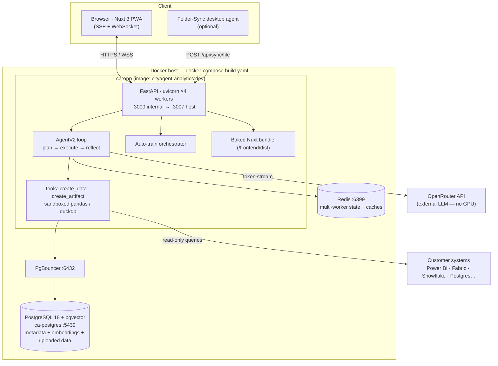
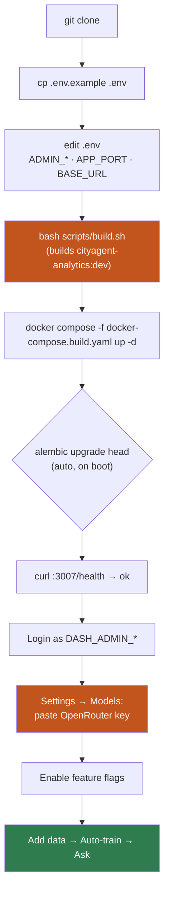
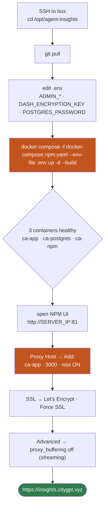
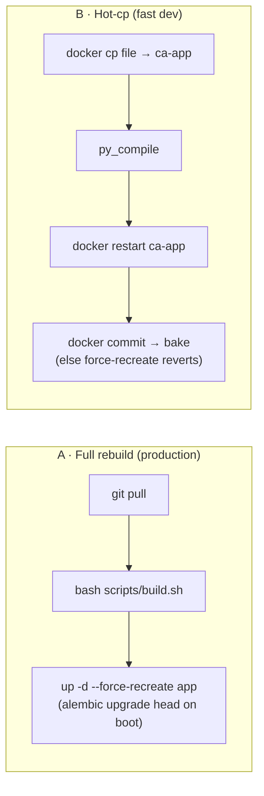
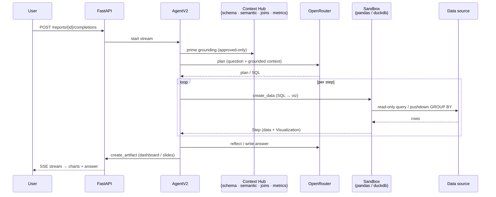
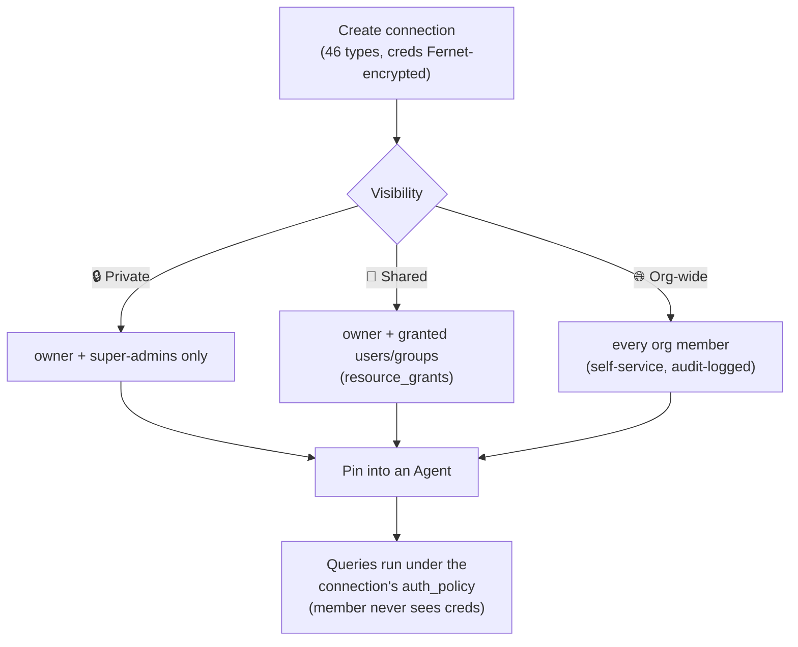

# CityAgent Analytics

> **Agentic analytics platform.** Wrap your data (file uploads or 46 warehouse connectors) into a grounded,
> shareable **Agent** that answers questions, builds dashboards + slide decks, and trains itself — no per-dataset code.

Extended with a Karpathy-style 2nd-brain, a per-studio **Auto-train** pipeline, lightweight Domain-Pack
"Skills", and an 8-layer Intelligence grounding stack.

| | |
|---|---|
| **Version** | `VERSION_HYBRID` — see file (currently **1.160.4**) |
| **Backend** | FastAPI (Python 3.12), async SQLAlchemy, Alembic (auto-migrate on boot) |
| **Frontend** | Nuxt 3 SPA (`ssr:false`), baked into the image via `nuxt generate` |
| **Data** | PostgreSQL 18 + pgvector · PgBouncer · Redis |
| **LLM** | **OpenRouter only** (per-org, Fernet-encrypted key — **no GPU needed**) |
| **Image** | single `cityagent-analytics:dev`, served on `:3007` |
| **Stack file** | **`docker-compose.build.yaml` only** |

> Deep engineering guide + landmines → **`CLAUDE.md`** · Codebase map → **`docs/CODEBASE_MAP.md`** ·
> Dated history → **`DEVLOG.md`** · Full pipeline → **`NEWPIPE.md`**.

---

## Contents

- [What it is](#what-it-is)
- [Architecture](#architecture)
- [Quick start](#quick-start)
- [Install flow](#install-flow)
- [Configuration (`.env`)](#configuration-env)
- [Deploy modes](#deploy-modes)
- [Deploy behind HTTPS — engineer flow (NPM)](#deploy-behind-https--engineer-flow-npm)
- [Update & rollback](#update--rollback)
- [How a question is answered](#how-a-question-is-answered)
- [Auto-train pipeline](#auto-train-pipeline)
- [Connector model](#connector-model)
- [Intelligence Layer](#intelligence-layer)
- [Feature flags](#feature-flags)
- [Key endpoints](#key-endpoints)
- [Repo layout](#repo-layout)
- [Troubleshooting](#troubleshooting)
- [Contributor rules](#contributor-rules)

---

## What it is

An **Agent** (internally a Studio / DataSource) pins a set of data sources and becomes a grounded analyst:

1. **Add data** — upload `.csv`/`.xlsx`, or pin a connector (Postgres, Power BI, Fabric, Snowflake… 46 types).
2. **Auto-train** — one click profiles columns, mines joins, extracts knowledge from docs, writes example
   queries + eval goldens, and generates artifacts. Readiness climbs 0→100 in the background.
3. **Ask** — the agent answers grounded on *your* data, builds interactive dashboards (React + ECharts) and
   slide decks (python-pptx), and shows its work.

Everything new is **flag-gated** (default OFF) and everything learned is **review-gated** (pending → approve).

---

## Architecture



**Key fact:** the LLM is external (OpenRouter) → **no GPU**. Your infra orchestrates, runs SQL, ingests files,
and streams tokens. Uploaded data lands in **Postgres** (its main storage driver). Full sizing (500 users /
50% concurrent ≈ 26 vCPU / 110 GB / 1 TB SSD) → **`docs/INFRA_SIZING.md`**.

---

## Quick start

**Prereqs:** Docker + Docker Compose v2 · give Docker **≥10 GB RAM** (the `nuxt generate` step forces a 6 GB
Node heap; less = OOM/exit-134) · ~15 GB free disk · free host ports `3007` / `5439` / `6399`.

```bash
# 1. Clone
git clone git@github.com:raahulgupta07/rahulai-dash.git
cd rahulai-dash        # (or:  cd "CityAgent Analytics")

# 2. Config
cp .env.example .env
#    Edit .env — set at minimum:
#      DASH_ADMIN_EMAIL / DASH_ADMIN_PASSWORD / DASH_ADMIN_NAME   (first-boot super-admin)
#      APP_PORT=3007  +  DASH_BASE_URL=http://<host>:3007         (must match)
#      DASH_ENCRYPTION_KEY  -> leave EMPTY (auto-generated + persisted on first boot)

# 3. Build (first cold build ~15–25 min; code-change rebuilds are seconds–2 min)
bash scripts/build.sh                                    # pre-pulls bases w/ retry, builds cityagent-analytics:dev

# 4. Run (Postgres + Redis + app; runs `alembic upgrade head` on boot)
docker compose -f docker-compose.build.yaml up -d

# 5. Verify
curl http://localhost:3007/health                        # -> {"status":"ok"}
docker compose -f docker-compose.build.yaml logs -f app   # watch migrations + "Loaded N hybrid flag override(s)"
```

**Then, in the browser** (`http://<host>:3007`):

1. Log in with the `DASH_ADMIN_*` you set (or fill the **Create super-admin** form on a zero-user install).
2. **Settings → Models** → paste your **OpenRouter API key** (required — nothing AI works without it; stored
   encrypted per-org, never in the repo/`.env`).
3. **Settings → Feature Flags** → enable the features you want (all default OFF).
4. Open an Agent → **Auto-pilot → Upload file** (or pin a connector) → **Auto-train everything** → ask a question.

> **Two rules — never break:**
> 1. Always pass `-f docker-compose.build.yaml` (a plain `docker compose up` = different project = empty DB).
> 2. **Never** `docker compose down -v` — `-v` deletes the database volume (all data gone).

---

## Install flow



---

## Configuration (`.env`)

Copy `.env.example` → `.env`. Only the host (left) port numbers change; container-internal ports
(`3000` app, `5432` db, `6379` redis) are fixed.

| Var | What | Notes |
|---|---|---|
| `DASH_ADMIN_EMAIL` / `DASH_ADMIN_PASSWORD` / `DASH_ADMIN_NAME` | first owner/admin, seeded on boot | idempotent — ignored once any user exists |
| `DASH_ENCRYPTION_KEY` | Fernet key encrypting per-org secrets (LLM/SMTP) | **leave empty** → auto-generated + persisted to the `ca_uploads` volume. Set explicitly only for multi-host or DB-restore. **Never change it** — a new key orphans every stored secret. |
| `APP_PORT` | host port for **direct / Caddy** modes | maps `<APP_PORT>` → container 3000 |
| `HTTP_PORT` | host port for **nginx** mode | ignored by direct/Caddy |
| `POSTGRES_PORT` / `REDIS_PORT` | host DB / cache ports | default `5439` / `6399` — change only if busy |
| `DASH_BASE_URL` | external base URL | **must match** your published port/domain (CORS, embed, webhooks) |
| `ENVIRONMENT` | `development` \| `production` | compose sets `production` |
| `OPENROUTER_API_KEY` | *(optional)* auto-lights seeded models | else paste in **Settings → Models** later |

> **Landmine:** a compose `${VAR:-default}` beats the in-app registry default. If a setting won't take, check
> the compose env first. The **OpenRouter key is NOT an env var** by design — it's entered in the UI, stored
> encrypted per-org.

---

## Deploy modes

Pick **one** — only one runs at a time (`docker compose down` the old one before switching; never `-v`).

| Mode | Compose file | Port var | Proxy | Use when |
|---|---|---|---|---|
| **Direct** (simplest) | `docker-compose.build.yaml` | `APP_PORT` | none | internal / behind an existing host proxy |
| **nginx** | `docker-compose.nginx.yaml` | `HTTP_PORT` | nginx (SSE/WS/large-upload tuned) | you already run nginx |
| **Caddy (HTTPS)** | `docker-compose.yaml` | `APP_PORT` | Caddy, auto-TLS | public domain, automatic HTTPS |
| **NPM / AWS** | `docker-compose.npm.yaml` | via proxy | Nginx-Proxy-Manager | the live AWS box (`insights.citygpt.xyz`) — **see engineer flow below** |

The app always listens on **3000 internally** (the `http://0.0.0.0:3000` log line is normal). **Prod needs
HTTPS** for the PWA install + service worker; `http://localhost:3007` is exempt for testing.

> `docker-compose.npm.yaml` is a **drop-in superset** of `docker-compose.build.yaml` — identical `ca-app` /
> `ca-postgres` / `ca-redis` names, `ca-network`, and `ca_*` volumes — **plus** an `nginx-proxy-manager`
> (`ca-npm`) on the same network. Same data, plus HTTPS. Run **one or the other**, never both at once.

---

## Deploy behind HTTPS — engineer flow (NPM)

This is the flow for the live AWS box (`insights.citygpt.xyz`). Nginx Proxy Manager (NPM) terminates
HTTPS and reverse-proxies to the app; you add the domain + Let's Encrypt cert by **clicking in a web UI** —
no hand-edited nginx.conf, no certbot.



**1. Bring the stack up (app + db + redis + NPM, one network):**
```bash
ssh <box> && cd /opt/agent-insights
git pull
# .env must have DASH_ENCRYPTION_KEY (keep the SAME one — a new key orphans every stored secret),
# DASH_ADMIN_*, POSTGRES_PASSWORD, and AUTOTRAIN_STAGING_ROLE_SECRET (Phase 0).
docker compose -f docker-compose.npm.yaml --env-file .env up -d --build
docker compose -f docker-compose.npm.yaml ps          # ca-app / ca-postgres / ca-redis / ca-npm all Up
```

**2. Open the NPM admin UI** → `http://<SERVER_IP>:81` (first login `admin@example.com` / `changeme`, it forces
a change). **Hosts → Proxy Hosts → Add Proxy Host:**

| Field | Value | Why |
|---|---|---|
| Domain Names | `insights.citygpt.xyz` | your DNS A record → box public IP |
| Scheme | `http` | NPM does the TLS; app is plain http internally |
| **Forward Hostname** | **`ca-app`** | the **container name** — NOT an IP, NOT `app`, NOT `8077` |
| **Forward Port** | **`3000`** | the app's **internal** port (Aria was 8077 — this is 3000) |
| Websockets Support | **ON** | chat streaming / live updates |
| Block Common Exploits | ON | — |

**3. SSL tab** → request a new **Let's Encrypt** cert · **Force SSL** · HTTP/2.

**4. Advanced tab** (REQUIRED — chat streams token-by-token; without this it looks frozen):
```nginx
proxy_buffering off;
proxy_cache off;
proxy_request_buffering off;
proxy_http_version 1.1;
proxy_read_timeout 3600s;
proxy_send_timeout 3600s;
client_max_body_size 0;
```

**5. DNS + firewall:** point `insights.citygpt.xyz` → box public IP; open security-group ports **80 + 443**
(+ **81** for the UI, ideally restricted to your IP).

Then browse `https://insights.citygpt.xyz` → log in as `DASH_ADMIN_*` → **Settings → Models** (OpenRouter key) →
**Settings → Feature Flags**.

> **Why the earlier attempt showed no UI (fixed in v1.160.4):** the old `docker-compose.npm.yaml` used a
> *different* identity (`dash-*` names / `dash-network`) than the running `ca-*` stack, so NPM couldn't resolve
> the app → 502. **The rule:** a reverse proxy for a compose stack must be on the **same docker network** and
> forward to the app's **container name + internal port** (`ca-app:3000`) — never a host IP or another app's
> port. The app also now runs uvicorn with `--proxy-headers --forwarded-allow-ips='*'` so login cookies + wss
> work behind the TLS proxy (baked in — needs the rebuild in step 1).

---

## Update & rollback



```bash
# A · Full rebuild — clean, durable
git pull
bash scripts/build.sh
docker compose -f docker-compose.build.yaml up -d --force-recreate app
```
🔴 **Never `--force-recreate` onto a stale/un-rebuilt image** — DB ahead of image migrations = broken app.
Verify the new image contains your code first.

```bash
# B · Hot backend (.py) — seconds, ephemeral until baked
docker cp <file> ca-app:/app/backend/app/...
docker exec ca-app /opt/venv/bin/python -m py_compile /app/backend/app/...
docker restart ca-app                                     # restart KEEPS cp'd files; force-recreate REVERTS
# Hot frontend:
bash scripts/fe-sync.sh                                    # nuxt generate + docker cp → ca-app:/app/frontend/dist
```

**Rollback:** every bake tags a rollback image — `docker tag cityagent-analytics:pre-v<prev> cityagent-analytics:dev`
then `up -d --force-recreate app`. Alembic downgrades aren't guaranteed — restore a DB dump if a migration must reverse.

- **Back up first on real deploys:** `docker exec ca-postgres pg_dump -U dash dash > backup_$(date +%F).sql`.
- **Every ship** bumps `VERSION_HYBRID` + prepends a `CHANGELOG_HYBRID.md` entry (🔔 What's-new bell). Both files
  are read per-request — `docker cp` both on a hot bake.
- **New flags default OFF.** Enable per-org in **Settings → Feature Flags**, then `docker restart ca-app`
  (workers=4 → one restart converges the change).

---

## How a question is answered



Two execution lanes keep it fast + memory-safe:
- **Wren lane** — text-to-SQL pushes aggregation to the DB / DuckDB-over-file (`GROUP BY` in SQL, not pandas).
- **Julius lane** — heavy Python runs in an **isolated one-shot subprocess** (memory reclaimed on exit; no
  in-process OOM accumulation). Real cap = container cgroup RSS + timeout + semaphore (**never** `RLIMIT_AS`).

---

## Auto-train pipeline

```mermaid
flowchart LR
    S["Pinned source<br/>(file or connector)"] --> P["Profile<br/>columns · roles · samples · null%"]
    P --> K["Knowledge<br/>extract defs from docs"]
    K --> Q["Queries<br/>LLM example SQL (verified read-only)"]
    Q --> E["Evals<br/>golden Q→expected from real aggregates"]
    E --> J["Joins<br/>value-overlap + proven-SQL mining"]
    J --> SM["Semantic + Metrics<br/>(if flags ON, auto-approved)"]
    SM --> A["Artifacts<br/>Summary · FAQ · Briefing · KPI pack · Dictionary"]
    A --> R(["Readiness 0→100"])

    style R fill:#2f7d4f,color:#fff
```



Async: `POST /studios/{id}/train`, poll `GET .../train/status` (per-table progress, 600 s/source timeout,
fail-soft). Re-trains skip unchanged tables (row-count watermark) and surface schema drift. Auto-train
**auto-approves** its own output, so the Review queue is empty after a run.

| Stage | Module | Notes |
|---|---|---|
| Profile | `column_intel` | every column, all tables |
| Knowledge | auto-configure | applied live from `.xlsx`/`.pptx` |
| Queries | `auto_queries` | read-only-verified before saving |
| Evals | `auto_evals` | golden Q→expected |
| Joins | `join_miner` | works day 1 (no history needed) |
| Semantic/Metrics | `semantic_metrics` | only when `HYBRID_SEMANTIC_LAYER` / `HYBRID_METRICS_CATALOG` ON |
| Artifacts | `studio_artifacts` | 6 generated docs |

---

## Connector model

**Every connection has an owner + a visibility; an agent only *references* (pins) connections — it never
stores credentials.** 46 connector types; each *type* is a template, each connection a **named instance**
(ten Postgres = ten rows; blank names auto-derive `Postgres · host/db`).



Manage (edit / test / rotate / delete) = the connection **owner** or any **super-admin**. Authz enforced by a
single `guard_owned_connection` dependency on every connector mutate route. Credentials are never returned to
the browser.

---

## Intelligence Layer

Eight additive, flag-gated grounding capabilities (default OFF), each surfaced per-agent in **Studio →
Intelligence** and read via `GET /api/intelligence/layer/{layer}`.

| Layer | Flag | What |
|---|---|---|
| Deep Profiler | `HYBRID_PROFILE_V2` | per-column role catalog + top-3 values + variant warnings |
| Lazy Profile / Drift | `HYBRID_PROFILE_V2` | inline-profiles a table added after training, at query time |
| Proactive Insights | `HYBRID_PROACTIVE_INSIGHTS` | z-score + IQR + spike scan → chips (no LLM) |
| Forecasting | `HYBRID_FORECAST` | Prophet `forecast_df` tool (needs prophet baked) |
| Golden Queries | `HYBRID_GOLDEN_QUERIES` | promote proven SQL (👍 or verified ≥2) → injected first |
| Code Enrich | `HYBRID_CODE_ENRICH` | LLM extracts grain / formulas / population → `pipeline_logic` |
| Verified Metrics | `HYBRID_VERIFIED_METRICS` | locked metric runs its own read-only calc, marked AUTHORITATIVE |
| Hybrid Search + KG | `HYBRID_SEMANTIC_SEARCH` | pgvector + BM25 RRF + entity graph |

**Wren/Julius optimization (v1.156–1.160.4)** adds: SQL pushdown + `sql_validate` (`HYBRID_SQL_VALIDATE`),
coder grounding (`HYBRID_CODER_GROUNDING`), paraphrase-aware learned-query recall via embedding+RRF
(`HYBRID_RECALL_RRF`), and Julius-quality output — analysis notebook (`HYBRID_ANALYSIS_NOTEBOOK`), data-aware
follow-ups (`HYBRID_FOLLOWUPS_DATA_AWARE`), broadened smart-viz (`HYBRID_SMART_VIZ`), grounded starters
(`HYBRID_STARTERS_DATA_GROUNDED`). Detail → `CLAUDE.md` "Current state".

---

## Feature flags

All new features live in `backend/app/settings/hybrid_flags.py` (env `HYBRID_*`, default OFF). Flip per-org
live via **Settings → Feature Flags** (writes `organization_settings.config.hybrid_overrides`, loaded at boot →
`docker restart ca-app` to converge across workers). A flag needs **3 places** or it's invisible: a `@property`,
an `UPGRADE_FLAGS` entry, and a `snapshot()` entry.

Common flags: `STUDIOS · COLUMN_INTEL · AUTO_QUERIES · AUTO_EVALS · JOIN_GRAPH · DOC_KNOWLEDGE · SEMANTIC_LAYER ·
METRICS_CATALOG · DOMAIN_PACKS · TEACH_BOX · SCOPE_GATE · FOLLOWUPS · AGENT_TEMPLATES · FOLDER_SYNC ·
AGENT_REPORTS · RICH_REPORT_EMAIL · ONECLICK_ARTIFACTS · GROUP_ACCESS · USER_GROUPS`.

> For stability, heavy sandbox Skills / sub-agents / MCP are OFF by default; the lightweight Domain-Pack path is
> the supported "skills" mechanism.

---

## Key endpoints

Org-scoped calls need header `X-Organization-Id`. Login: `POST /api/auth/jwt/login` (form `username`/`password`).

| Endpoint | Purpose |
|---|---|
| `GET /health` | liveness (`{"status":"ok"}`) |
| `POST /api/auth/jwt/login` · `POST /api/auth/register` | auth (first registrant = org owner) |
| `POST /api/reports/{id}/completions` · `GET .../completions` | run / poll a chat completion |
| `POST /api/completions/{id}/sigkill` | stop a running generation |
| `POST /api/studios/{id}/train` · `GET .../train/status` | auto-train + progress |
| `POST /api/data_sources/demos/chinook` | load the built-in demo DB |
| `GET /api/reports/{id}/notebook` | analysis "show-your-work" trail (flag) |
| `POST /api/reports/{id}/dashboard/generate` · `.../slides/generate` · `GET .../workbook` | one-click artifacts |
| `GET /api/organization/hybrid-flags/{env}` · `PUT` | read / flip feature flags |
| `POST /api/sync/file` · `GET /api/sync/{status,agents,key}` | Folder-Sync desktop agent |
| `GET /api/changelog` | 🔔 What's-new feed |

---

## Repo layout

```
backend/
  main.py                       # app factory; ALL router includes; load_overrides_from_db on boot
  app/
    ai/
      agent_v2.py               # planner/execute/reflect loop (CORE)
      context/ · context_hub.py # grounding builders (schema/semantic/joins/metrics)
      agents/coder/             # code-gen + grounding + pushdown
      knowledge/                # train_orchestrator · notebook · followups · query_learning
      tools/implementations/    # drop a file = auto-registered tool
    data_sources/clients/       # <type>_client.py per connector (BaseClient)
    routes/ · services/         # FastAPI routers + business logic
    settings/hybrid_flags.py    # HYBRID_* flags (3-place: property + UPGRADE_FLAGS + snapshot)
    alembic/                    # migrations (chain off single true head — now: biuplift1)
frontend/
  pages/ · components/          # Nuxt 3 SPA (useMyFetch → BARE paths, prepends /api)
folder-sync-agent/             # standalone desktop ingest agent (baked at /app/folder-sync-agent)
scripts/build.sh · fe-sync.sh   # build image · hot FE sync
docker-compose.build.yaml       # THE stack file
```

---

## Troubleshooting

| Symptom | Cause / fix |
|---|---|
| `/health` not `ok` | still booting — `docker logs ca-app`, re-check |
| Chat/train 401 immediately | no OpenRouter key — paste in **Settings → Models** (encrypted per-org, not `.env`) |
| Dashboard hangs "Starting… 0/0" on Power BI | fixed in **v1.160.2** (429 throttle storm) + **v1.160.3** (real-schema discovery via `INFO.VIEW.COLUMNS` kills the brute-probe at source); rebuild if on older |
| Stop button 500 | fixed in **v1.160.2** (sigkill returned raw ORM → recursion); rebuild if on older |
| **Domain shows 502 / blank behind NPM** | NPM must be on the **same docker network** as the app and forward to **`ca-app:3000`** (container name + internal port, NOT a host IP, NOT `8077`). Use `docker-compose.npm.yaml` (drop-in superset of build.yaml). Fixed in **v1.160.4** — see [engineer flow](#deploy-behind-https--engineer-flow-npm). |
| Login redirects to `http://` / cookie not set behind HTTPS | needs uvicorn `--proxy-headers` (baked in **v1.160.4**) — rebuild the image on the box |
| Boot log: `duplicate key … pg_type_typname_nsp_index` then "startup failed" | multi-worker race creating `apscheduler_jobs` on a fresh DB — fixed in **v1.160.4** (pre-fork `CREATE TABLE IF NOT EXISTS`); self-heals on older versions after a restart |
| `bind: address already in use` | another process owns the host port — `ss -ltnp \| grep <port>`, pick a free `APP_PORT`/`HTTP_PORT` |
| Logs say `:3000` but you set another port | that's the container-internal port (always 3000) — normal; your host port is in `docker compose ps` |
| FE change didn't show | you skipped the bake — `fe-sync.sh` then `docker commit` (or full rebuild) |
| FE/BE change vanished after recreate | `--force-recreate` reverts to the image — bake first (`docker commit` / rebuild) |
| Setting won't take | a compose `${VAR:-default}` is overriding the registry default |
| Semantic/Metrics tabs empty | enable `HYBRID_SEMANTIC_LAYER` / `HYBRID_METRICS_CATALOG`, re-run Auto-train |
| Empty DB after `up` | you ran a plain `docker compose up` — always pass `-f docker-compose.build.yaml` |
| Data gone | someone ran `docker compose down -v` — the `-v` drops the DB volume. Never use it. |

---

## Contributor rules

1. **OpenRouter only** for LLM (Dash `custom` provider, per-org encrypted key).
2. Touch core **minimally** — prefer new files + hook points.
3. Everything new is **flag-gated** (default OFF); everything learned is **review-gated** (pending → approve).
4. New routes registered in `backend/main.py`; migrations chain off the **single true head** (mind tuple
   `down_revision` in merges); flags need no migration, new tables do.
5. **Never return a raw ORM object with loaded relationships from a route** — serialization recurses → 500
   (return a schema or plain dict).
6. **UI/UX = `DESIGN_SYSTEM.md`** (clay brand tokens, serif H1, 3 button variants, no `gray-*`).
7. **Agents are scoped to their data** — `HYBRID_SCOPE_GATE` (default ON) refuses off-topic questions.
8. Bump `VERSION_HYBRID` + prepend `CHANGELOG_HYBRID.md` on every ship (🔔 bell auto-updates).